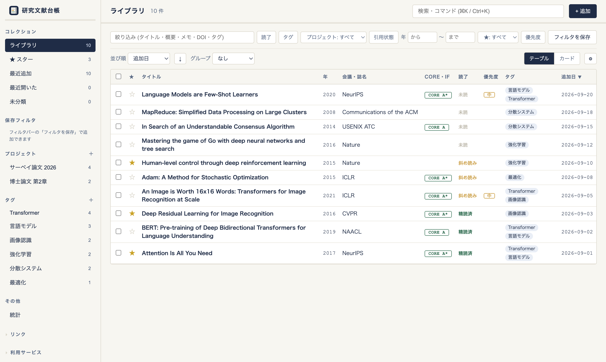
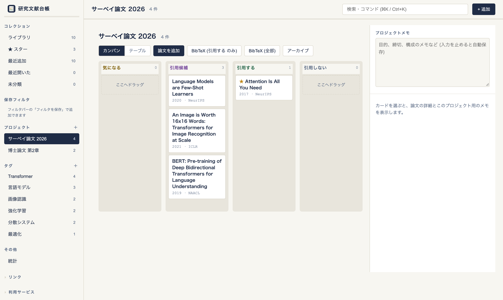
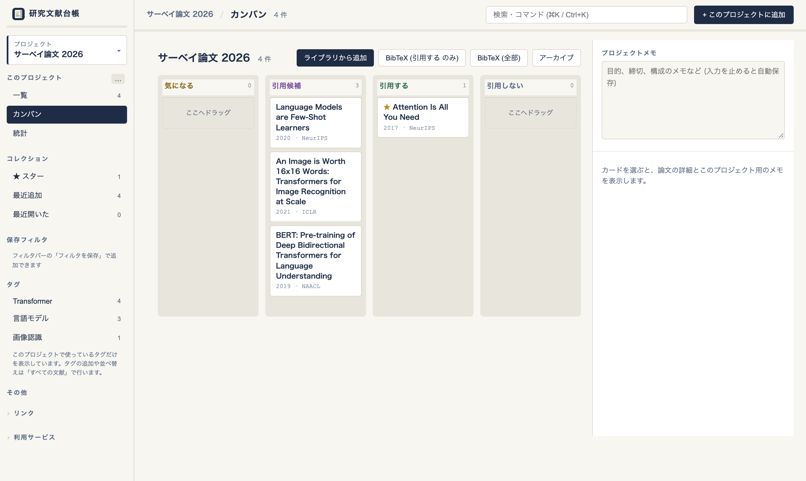
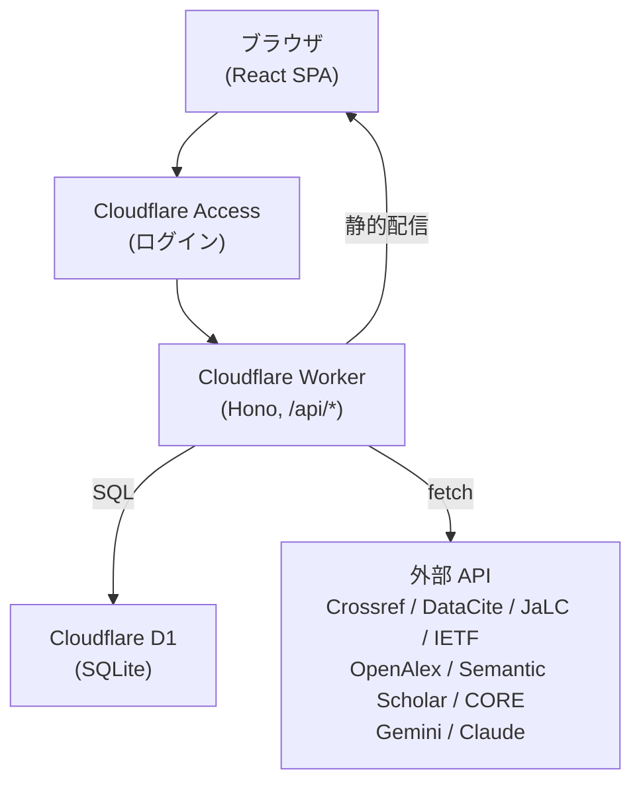

<p align="center">
  
</p>

<h1 align="center">Daicho 台帳</h1>

<p align="center">
  Cloudflare Workers と D1 で動く、自分専用の文献管理 Web アプリ
</p>

<p align="center">
  <a href="LICENSE"></a>
  
  
  
  
  
</p>

<p align="center">
  <a href="BUILD.md">構築手順</a> |
  <a href="#特徴">特徴</a> |
  <a href="#セットアップ">セットアップ</a> |
  <a href="#制限事項">制限事項</a>
</p>

<p align="center">
  
</p>

<p align="center">
  
</p>

<p align="center">
  
</p>

<p align="center"><sub>画面は公開論文を使ったデモデータです。</sub></p>

研究論文のサーベイを、Cloudflare の無料枠だけで動く Web アプリとして管理します。データは Cloudflare D1 (SQLite) に保存され、いつでも CSV / JSON でエクスポートできるので、アプリを捨ててもデータは表として残ります。Cloudflare Access で自分のアカウントだけにアクセスを絞れます。


---

## 特徴

### 📚 ライブラリ

件数が増えても探しやすいテーブルと、右側の詳細パネルで全体を管理します。

- **テーブル表示** — ★ / タイトル / 年 / 会議・誌名 / CORE・IF / 読了 / 優先度 / タグ / プロジェクト数 / 追加日 / 最近開いた。列見出しでソート、「表示」で並び順・グループ・列を切り替え。カード表示にも切り替え可
- **絞り込み** — 検索欄と「絞り込み」の 2 つだけを常に表示。使用中の条件はチップで並び、× で 1 つずつ外せます
- **グループ化** — 年 / 読了状態 / 優先度 / 先頭タグ / 会議名でまとめ、グループごとに折りたたみ
- **組み込みコレクション** — ★ スター / 最近追加 (30 日) / 最近開いた / 未分類 (タグもプロジェクトも無い論文)。サイドバーの全項目に件数バッジ
- **保存フィルタ** — 読了・タグ (any / all)・プロジェクト・引用状態・年範囲・★・優先度・検索語の組み合わせに名前を付けて保存し、サイドバーから呼び出し
- **Cmd-K 検索** — ⌘K / Ctrl-K でタイトル・BibTeX キー・タグ・プロジェクト名を横断検索して移動。追加・BibTeX 出力・重複チェック・AI タグ提案・統計もここから
- **一括操作** — 「選択」を押すと選択モードになり、チェックボックスが出ます。論文を選んでタグ付け・プロジェクトへ追加・読了・★・BibTeX をまとめて実行。AI タグ提案・優先度・削除は「その他」から。通常のクリックは詳細を開くだけで、選択はしません
- **重複マージ** — タイトル / DOI / BibTeX キーが重なるエントリを並べ、残す 1 件を選んでマージ (タグ・プロジェクト所属・メモは統合)
- **★ と優先度** — 詳細パネルやキーボード (`s` で ★、`1`〜`3` / `0` で優先度) からすぐに変更
- **BibTeX 出力** — 選択した論文や絞り込み結果を BibTeX にしてコピー / ダウンロード
- **PDF** — 詳細パネルから PDF を選ぶかドロップすると、`{BibTeX キー} - {タイトル}.pdf` の名前で自分の Google Drive に保存し、URL を論文に付けます。1 つの論文に本文・補足資料・スライドなど複数付けられます。共有設定は変えないので、開けるのは自分のアカウントだけです ([設定手順](BUILD.md#8-pdf-を-google-drive-に保存する-任意))

### ✨ 書誌情報の自動入力と AI 支援

DOI を貼り付けるだけで、書誌情報から日本語要約までが埋まります。


- **書誌情報の自動入力** — DOI / URL / RFC 番号 / Internet-Draft 名から取得。Crossref・DataCite (arXiv)・JaLC (日本の学会誌)・IETF Datatracker に対応し、DOI 登録の無い論文は論文ページの citation メタタグから取得
- **LLM による概要生成** — Gemini (無料枠) / Claude Haiku を選択可。Abstract を 5 つのソースから自動収集し、Q&A 形式 (提案手法は? / 先行研究比は?) の日本語要約を生成
- **AI タグ提案** — 既存タグの中から適切なものを AI が提案 (選ばせる設計で分類が崩れない)
- **論文評価の管理** — Impact Factor と CORE Ranking を記録 (CORE Ranking はカンファレンス名から自動検索)
- **出版国の自動判定** — OpenAlex のジャーナル国を一次ソースとして判定。上書きテーブルで例外にも対応

### 📊 統計ビュー

登録した文献全体の傾向をダッシュボードで俯瞰できます。


- **5 つの集計カード** — 読了状態 / 出版年の分布 / CORE ランク分布 / タグ別件数 / 出版元の上位
- **いつでも表示** — サイドバーの「統計」または Cmd-K の「統計を開く」から開けます (URL は `#/stats`)

### 📁 プロジェクト (開くと画面全体がそのプロジェクトに絞られる)

論文の実体は全体で 1 つのままで、プロジェクトは「見る範囲」として働きます。同じ論文を複数のプロジェクトで使っても重複しません。

- **切り替え** — サイドバー先頭の切り替えでプロジェクトを選ぶと、一覧・タグ・件数・保存フィルタ・統計がそのプロジェクトの論文だけになります。「すべての文献」を選ぶと全体に戻ります
- **一覧** — 全体と同じ絞り込み・並べ替え・グループ化・一括操作が使えます。引用状態の列はその場で変更でき、引用状態ごとのグループ化も選べます
- **登録と同時に追加** — プロジェクトを開いて「+ このプロジェクトに追加」から登録すると、その論文は最初からプロジェクトに入ります。追加ダイアログでは、入れるプロジェクトと引用状態を複数選べます
- **ライブラリから追加** — 登録済みの論文は、Cmd-K と同じ検索で複数選んで追加 (最初は「気になる」)
- **プロジェクトから外す** — 一覧で選択して一括で外せます。論文そのものは残ります
- **カンバン** — 気になる / 引用候補 / 引用する / 引用しない の 4 列。カードを別の列へドラッグすると引用状態が変わり、列の中でドラッグすると並び順を保存
- **メモ** — プロジェクト全体のメモ (入力を止めると自動保存) と、論文ごとの「このプロジェクトでの使い方」メモ
- **検索** — Cmd-K は全体から探し、開いているプロジェクトの論文を先に並べます。それ以外の論文には「プロジェクト外」と表示します
- **BibTeX** — 「引用する」の論文だけ、またはプロジェクト内の全部をワンクリックで出力
- **改名・並べ替え・アーカイブ・削除** — 「すべての文献」ではサイドバーの各プロジェクトの `…` メニューから、プロジェクトを開いているときは「このプロジェクト」の `…` メニューから

| URL | 画面 |
|---|---|
| `#/library` `#/stats` | すべての文献 |
| `#/project/:id/library` | プロジェクトの一覧 |
| `#/project/:id` | プロジェクトのカンバン |
| `#/project/:id/stats` | プロジェクトの統計 |

## アーキテクチャ



- 1 つの Worker が API (`/api/*`) と React の静的ファイルを配信します
- 認証は Cloudflare Access が Worker の手前で行うため、アプリ側に認証コードはありません
- LLM の API キーは Worker の Secret に保存します (リポジトリには含めません)

## 外部サービス

| サービス | 用途 |
|---|---|
| [Crossref API](https://www.crossref.org/documentation/retrieve-metadata/rest-api/) | 学術論文の DOI メタデータの取得 (第1候補) |
| [Semantic Scholar API](https://www.semanticscholar.org/product/api) | 学術論文の DOI メタデータの取得  (第2候補) |
| [OpenAlex API](https://help.openalex.org/api/)| 学術論文の DOI メタデータの取得  (第3候補) |
| [DataCite API](https://support.datacite.org/docs/api) | arXiv 等のプレプリント論文の DOI メタデータの取得 |
| [JaLC API](https://api.japanlinkcenter.org/api-docs/index.html) | 日本の学会誌 (IEICE 和文誌など) の メタデータの取得 |
| [IETF Datatracker API](https://datatracker.ietf.org/api/) | Internet-Draft のメタデータの取得 |
| [Google Gemini API](https://ai.google.dev/gemini-api/docs?hl=ja) | 概要生成・タグ提案 |
| [Anthropic Claude API](https://platform.claude.com/docs/en/api/overview) | 概要生成・タグ提案 |
| [CORE Portal](https://portal.core.edu.au/conf-ranks/) | 会議ランクの自動検索 |
| [Journal Citation Reports](https://clarivate.com/academia-government/scientific-and-academic-research/research-funding-analytics/journal-citation-reports/) | 論文 IF の検索 (手動検索のみ) |

## セットアップ

> Web 操作を中心にした構築手順と、GitHub への push で自動デプロイする設定は [BUILD.md](BUILD.md) にあります。以下はターミナル (Wrangler) で行う場合の手順です。

必要なもの: Node.js 22 以上、Cloudflare アカウント (無料プランで可)

1. **依存関係のインストールとログイン**
   ```bash
   npm install
   npx wrangler login
   ```
2. **D1 データベースの作成**
   ```bash
   npx wrangler d1 create daicho
   ```
   出力された `database_id` は `wrangler.toml` に書きません。`.env.example` を `.env` にコピーし、`D1_DATABASE_ID` に設定します。
   ```bash
   cp .env.example .env   # D1_DATABASE_ID=<出力された ID> を記入
   ```
   `wrangler.toml` の `database_id` はプレースホルダのままにします。デプロイ時に `.env` の値から `wrangler.deploy.toml` を生成します (どちらも gitignore 済み)。
3. **スキーマの適用**
   ```bash
   npm run db:migrate
   ```
4. **デプロイ**
   ```bash
   npm run deploy
   ```
   表示された `https://daicho.<your-subdomain>.workers.dev` がアプリの URL です。**この時点では誰でもアクセスできる**ので、続けて Access を設定します。
5. **Cloudflare Access で自分だけに制限する**
   1. Cloudflare Dashboard → Zero Trust を開き、未設定なら Free プランでチーム名を作成する
   2. Workers & Pages → `daicho` → **Access** タブ → **Protect this Worker behind Access** → **All traffic**
   3. ポリシーで許可するメールアドレスに自分のアドレスだけを入れる (ログインはメール OTP か Google)
   4. シークレットウィンドウでアプリ URL を開き、ログイン画面が出ることを確認する

## LLM 機能の設定

概要の自動生成と AI タグ提案を使う場合、API キーを Worker の Secret に登録します。

| Secret 名 | 取得先 | 費用 |
|---|---|---|
| `GEMINI_API_KEY` | [Google AI Studio](https://aistudio.google.com/) | 無料枠あり |
| `ANTHROPIC_API_KEY` | [Claude Console](https://platform.claude.com/) | 従量課金 (Haiku で要約) |

```bash
npx wrangler secret put GEMINI_API_KEY
npx wrangler secret put ANTHROPIC_API_KEY
```

Crossref / OpenAlex の polite pool を使うには、`wrangler.toml` の `CONTACT_MAILTO` にメールアドレスを設定して再デプロイします。

## ローカル開発

```bash
npm run db:migrate:local   # ローカル D1 にスキーマを適用
npm run build              # dist/ を生成 (clone 直後は空なので先に実行する)
npm run dev                # http://localhost:8787 (ビルド済み dist を配信)
npm run dev:web            # http://localhost:5173 (Vite HMR、/api は 8787 にプロキシ)
npm run check              # 型チェック + テスト
```

普段の開発は `npm run dev:web` を主に使ってください。`npm run dev` は `dist/` を配信するだけなので、ソースを変更するたびに `npm run build` が必要です。

ローカルで LLM を使うには `.dev.vars` に `GEMINI_API_KEY=...` を書きます (gitignore 済み)。

## ライブラリ UX 版への更新

すでに動いている環境を更新する場合は、追加のスキーマ (`migrations/0002_library_ux.sql`) を適用してからデプロイします。適用済みの `0001` は自動でスキップされます。

```bash
npm run db:migrate         # 本番 D1 に 0002 を追加適用
npm run db:migrate:local   # ローカル D1 にも適用
npm run deploy
```

- 旧 UI のカード配置 (`settings.layout`、スプレッドシートの `_レイアウト` シート) は使われなくなりました。データは消さずに残りますが、画面には反映されません。並び順はプロジェクトのカンバンで付け直してください
- 既存のプロジェクト所属は、最初は各列の中で追加日の新しい順に並びます

## Google スプレッドシート版からの移行

旧版 (Google Apps Script) のスプレッドシートから移行する手順です。

1. スプレッドシートの 4 シート (メインシート, `_タグ一覧`, `_プロジェクト一覧`, `_レイアウト`) をそれぞれ「ファイル → ダウンロード → CSV」で保存する (`_レイアウト` は非表示シートなので、右クリック → 再表示してから)
2. SQL に変換する
   ```bash
   npm run import-sheet --silent -- --main main.csv --tags tags.csv --projects projects.csv --layout layout.csv > import.sql
   ```
3. まずローカル D1 でドライランする (本番 DB に触れずに PK/FK 違反を検出できる)
   ```bash
   npm run db:migrate:local && npx wrangler d1 execute daicho --local --file=import.sql
   ```
4. 問題なければ本番 D1 に投入する
   ```bash
   npm run config:render && npx wrangler d1 execute daicho --remote --config wrangler.deploy.toml --file=import.sql
   ```

**注意:** このスクリプトは冪等ではありません。空の DB に 1 回だけ実行してください。やり直す場合は次で全消去できます。

```bash
npx wrangler d1 execute daicho --remote --config wrangler.deploy.toml --command "DELETE FROM cites; DELETE FROM entry_tags; DELETE FROM entries; DELETE FROM tags; DELETE FROM projects; DELETE FROM settings;"
```

## エクスポート

サイドバーの「リンク」から、または次の URL で全データを取得できます (ログイン後のブラウザで開く)。

- `/api/export?format=csv` — 旧版スプレッドシートと同じ 17 列
- `/api/export?format=json` — アプリが扱う JSON

## メンテナンス API

UI にはない一括処理です。Access の背後にあるので、[`cloudflared`](https://developers.cloudflare.com/cloudflare-one/connections/connect-apps/install-and-setup/installation/) を入れて `cloudflared access curl` で呼びます (初回にブラウザでログイン)。

```bash
APP=https://daicho.<your-subdomain>.workers.dev
# 重複 (タイトル / DOI / BibTeX キー) の一覧
cloudflared access curl $APP/api/maintenance/duplicates
# 同じ会場名の他エントリから IF / CORE の空欄を補完 (まずプレビュー)
cloudflared access curl -X POST -H 'content-type: application/json' -d '{"dryRun":true}'  $APP/api/maintenance/backfill-venue-ratings
cloudflared access curl -X POST -H 'content-type: application/json' -d '{"dryRun":false}' $APP/api/maintenance/backfill-venue-ratings
# 出版国を最新ロジックで再判定 (DOI ありのみ)。1 回 15 件まで処理し、応答の nextOffset が null になるまで offset を進めて繰り返す
cloudflared access curl -X POST -H 'content-type: application/json' -d '{"dryRun":false}' $APP/api/maintenance/backfill-countries
cloudflared access curl -X POST -H 'content-type: application/json' -d '{"dryRun":false,"offset":15}' $APP/api/maintenance/backfill-countries
```

## 設定のカスタマイズ

`src/worker/config.ts` に、編集しそうな設定を集約しています:

| 定数 | 内容 |
|---|---|
| `GEMINI_MODEL` / `CLAUDE_MODEL` | 要約・タグ提案に使うモデル名 |
| `HYBRID_VENUES` | ジャーナル形式だが実体は会議のものの対応表 |
| `COUNTRY_OVERRIDES` | 出版国の自動判定を上書きするジャーナル |
| `COUNTRY_CODE_JA` / `COUNTRY_JA` | 国コード・国名の日本語変換テーブル |

読了状態・引用状態の区分は `src/shared/types.ts` の `READ_STATES` / `CITE_STATES` です。

## 制限事項

- Workers 無料プランは 1 リクエストあたり CPU 時間 10 ms です。CORE ポータルや論文ページの HTML 解析で `Error 1102` が出る場合は、Workers Paid (月 5 ドル、30 秒) に切り替えてください
- BibTeX 出力は 1 回 45 件までです (外部リクエスト上限のため)。絞り込んでから出力してください
- 一括操作は 1 回 200 件までです (タグ・プロジェクトへ追加・読了・優先度・★・削除)。それ以上は絞り込んで分けて実行してください

## ライセンス

MIT License — 詳細は [LICENSE](LICENSE) を参照してください。
